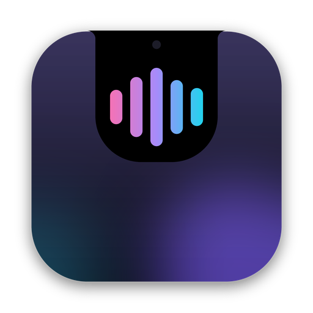
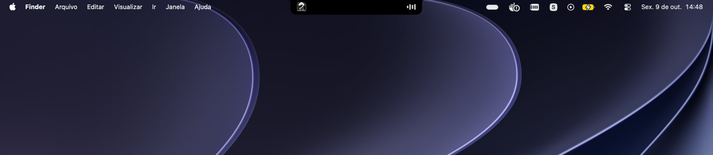
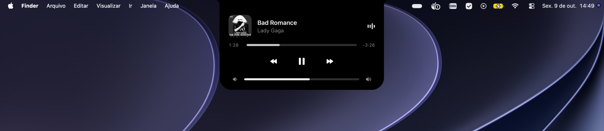

<p align="center"></p>

# Dynamic Lite

[](https://github.com/rafaelRizzo/dynamic-lite/releases/latest)


[](LICENSE)

Dynamic Island para macOS: uma forma preta "líquida" que vive no notch e vira player do Spotify.

> Inspirado no **Alcove**. Este é um projeto independente e open source, feito como uma alternativa livre. Não tem relação com o Alcove nem com seus criadores e não tem nenhuma intenção de prejudicá-los.

**Compact**: tocando, capa à esquerda e equalizer à direita do notch.



**Expanded**: mouse em cima, com progresso, controles e volume.



| Estado | Quando | Mostra |
|---|---|---|
| Idle | nada tocando | só o notch, invisível |
| Compact | Spotify tocando | capa à esquerda, equalizer à direita |
| Expanded | mouse sobre a Island | capa, faixa, progresso com seek, prev/play/next, volume |

- Pausado: a Island volta ao tamanho do notch, mas abre no hover pra dar play.
- Mac sem notch: simula um notch no topo central da tela (ou some sem música, configurável).
- Sem ícone no Dock. **Clique direito na Island** ou no ícone da menu bar: **Ajustes…** e **Sair**.
- Uma instância só: abrir o app de novo traz os Ajustes da que já está rodando.

## Ajustes

Clique direito na Island → **Ajustes…** (ou ícone da menu bar). Tudo vale na hora, sem reiniciar.

| Grupo | Ajuste | Opções |
|---|---|---|
| Aparência | Estilo do painel aberto | Preto, Translúcido (opacidade 60-100%), Vidro (Liquid Glass, macOS 26+) |
| | Cor de destaque | Da capa, Branca |
| Comportamento | Abrir com | Passar o mouse (com atraso ajustável), Clique |
| | Toque no trackpad | Clique leve sentido no dedo ao abrir e fechar |
| Tela | Mostrar em | Automática (tela com notch), Principal, ou uma tela pelo nome |
| | Mesas | Todas, ou só a atual (fica presa na mesa ativa ao escolher) |
| | Esconder no Mission Control | Não cobre a barra de mesas no topo |
| | Esconder sem música | Só em telas sem notch |
| Atualizações | Verificar automaticamente | Ao abrir e uma vez por dia; botão "Verificar agora" |
| Sistema | Iniciar com o macOS | |
| | Ícone na menu bar | Sem ele, o acesso é pelo clique direito |

O estado compacto é sempre preto, pra fundir com o notch. No **Vidro**, o painel aberto vira Liquid Glass saindo do notch, com o mesmo formato e animação do Preto ([ADR 0004](docs/adr/0004-liquid-glass-nativo.md)); em macOS sem suporte, cai pro Translúcido.

Ficam salvos em `~/Library/Application Support/com.rafael.dynamic-lite/settings.json`. Pra voltar ao padrão, apague esse arquivo e reabra o app.

## Baixar

Pegue o `.dmg` mais recente em [Releases](https://github.com/rafaelRizzo/dynamic-lite/releases/latest). É universal (Apple Silicon e Intel). Depois siga [Instalar](#instalar).

## Requisitos

- macOS 12+ (Apple Silicon ou Intel)
- [Xcode Command Line Tools](https://developer.apple.com/xcode/resources/): `xcode-select --install`
- [Rust](https://rustup.rs): `curl --proto '=https' --tlsv1.2 -sSf https://sh.rustup.rs | sh`
- [Bun](https://bun.sh): `curl -fsSL https://bun.sh/install | bash`
- Spotify desktop instalado

## Desenvolvimento

```bash
bun install
bun run tauri dev
```

Hot reload no React; mudanças em `src-tauri/` recompilam e reiniciam o app sozinhas.

## Gerar o app e o DMG

```bash
bun run tauri build
```

Saída:

| Arquivo | Caminho |
|---|---|
| App | `src-tauri/target/release/bundle/macos/Dynamic Lite.app` |
| Instalador | `src-tauri/target/release/bundle/dmg/Dynamic Lite_<versão>_<arch>.dmg` |

Só o `.app` (mais rápido, sem DMG):

```bash
bun run tauri build --bundles app
```

### Universal (Apple Silicon + Intel)

Precisa do Rust via **rustup** (o Rust do Homebrew só tem o target da máquina atual):

```bash
brew uninstall rust            # se instalou pelo Homebrew
curl --proto '=https' --tlsv1.2 -sSf https://sh.rustup.rs | sh
rustup target add x86_64-apple-darwin aarch64-apple-darwin
bun run tauri build --target universal-apple-darwin
```

Sai em `src-tauri/target/universal-apple-darwin/release/bundle/`.

### Versão

A versão do app vem da última tag `vX.Y.Z` do git: `bun run tauri dev/build` passa por [scripts/tauri.sh](scripts/tauri.sh), que lê a tag e injeta no build sem editar arquivos. Sem tag, vale a do `tauri.conf.json`. Pra forçar uma versão: `APP_VERSION=1.2.3 bun run tauri build`.

Ao compilar aparecem duas linhas de versão:

- `Dynamic Lite vX.Y.Z`: impressa pelo [scripts/tauri.sh](scripts/tauri.sh), segue a última tag do git. É a versão do app.
- `Compiling dynamic-lite v0.1.0`: do Cargo, é a versão do pacote Rust no `Cargo.toml`. Não muda com a tag e não aparece pro usuário.

### Ícone

O ícone é desenhado em código por [generate-icon.py](scripts/generate-icon.py) (Python + Pillow). Pra mudar, edite o script e rode:

```bash
python3 scripts/generate-icon.py
bun run tauri icon src-tauri/icons/app-icon.png
rm -rf src-tauri/icons/{android,ios,Square*Logo.png,StoreLogo.png,icon.ico,64x64.png}  # só macOS
cp src-tauri/icons/icon.png src/assets/icon.png && sips -Z 256 src/assets/icon.png
```

## Instalar

1. Feche qualquer `tauri dev` rodando (senão aparecem duas Islands).
2. Abra o `.dmg` e arraste **Dynamic Lite** pra **Aplicativos**, ou:
   ```bash
   cp -R "src-tauri/target/release/bundle/macos/Dynamic Lite.app" /Applications/
   open "/Applications/Dynamic Lite.app"
   ```
3. Aceite o pedido de **Automação → Spotify**.
4. Opcional: menu bar → **Iniciar com o macOS**.

## Releases automáticas

| Evento | Workflow | O que faz |
|---|---|---|
| PR pra `main` | [ci.yml](.github/workflows/ci.yml) | Typecheck, build do frontend, `cargo check` e prévia da próxima versão no resumo do job |
| Push/merge na `main` | [release.yml](.github/workflows/release.yml) | Calcula a versão, builda o `.dmg` universal, cria a tag `vX.Y.Z` e publica a release |

A versão sai dos commits desde a última tag ([Conventional Commits](https://www.conventionalcommits.org/pt-br/)):

| Commit | Exemplo | 0.1.0 vira |
|---|---|---|
| `feat` | `feat: Adicionado volume` | 0.2.0 |
| `fix`, `perf`, `refactor`, `ui` | `fix: Corrigida linha do vidro` | 0.1.1 |
| `!` ou `BREAKING CHANGE` no corpo | `feat!: Trocado formato das Settings` | 1.0.0 |
| `docs`, `chore`, `ci`, `style`, `test`, `build` | `docs: README` | sem release |

A tag é a fonte da verdade: a `main` não recebe commit de versão. No CI a tag nova ainda não existe na hora do build, então a action passa a versão por `APP_VERSION` pro [tauri.sh](scripts/tauri.sh). A lógica está em [next-version.sh](.github/scripts/next-version.sh) (dá pra rodar local pra ver a próxima versão). Também dá pra disparar manualmente em Actions → Release → Run workflow.

A tag é criada logo no início, antes do build; se o build falhar ou for cancelado (um push novo cancela a release anterior em andamento), ela é apagada. No CI o build usa LTO "thin" e cache do Rust (salvo mesmo em falha) pra ficar mais rápido; o `Cargo.toml` local continua com LTO completo.

## Atualizações automáticas

O app verifica atualização ao abrir (10s depois) e a cada 24h, lendo o `latest.json` da última Release do GitHub (plugin oficial `tauri-plugin-updater`). Dá pra desligar em Ajustes → Atualizações → **Verificar automaticamente**; tem também o botão **Verificar agora**.

Quando há versão nova:

- Aparece uma Activity na Island, só quando não tem música tocando (o Now Playing tem prioridade), com **Depois** e **Instalar e reabrir**.
- O item **Instalar atualização vX e reabrir** aparece no clique direito, no menu da menu bar e nos Ajustes.
- **Depois** esconde o aviso até a próxima checagem.

O pacote de update (`.app.tar.gz`) é assinado com uma chave própria do updater (minisign), diferente da assinatura da Apple:

| Chave | Onde |
|---|---|
| Pública | `src-tauri/tauri.conf.json` (`plugins.updater.pubkey`) |
| Privada | `~/.tauri/dynamic-lite.key` (senha em `~/.tauri/dynamic-lite.key.password`) e secrets `TAURI_SIGNING_PRIVATE_KEY` e `TAURI_SIGNING_PRIVATE_KEY_PASSWORD` no environment `release` do GitHub (liberado só pra `main`) |

> [!WARNING]
> Guarde a chave privada num gerenciador de senhas. Se perder, quem tem o app instalado não recebe mais update automático e precisa baixar o `.dmg` de novo.

Build local: o [scripts/tauri.sh](scripts/tauri.sh) usa a chave de `~/.tauri` se existir. Se não existir (ex.: quem clonou o repo), builda sem os artefatos de update.

Só funciona a partir da primeira versão publicada com o updater; versões anteriores precisam baixar o `.dmg` uma vez.

### Segurança do CI

- Actions fixadas por SHA do commit (tag no comentário); o [Dependabot](.github/dependabot.yml) abre PR `ci:` quando sai versão nova.
- Permissões mínimas: `ci.yml` só lê; no `release.yml` só os jobs de tag e release escrevem.
- Chave de assinatura só no environment `release`, que só roda na `main`.
- A `main` bloqueia force-push e exclusão (ruleset "Proteger main"); push direto continua liberado.

## Distribuir pra outras pessoas

O build local não é assinado. Em outro Mac, o Gatekeeper bloqueia o app baixado. Opções:

- **Sem conta de desenvolvedor**: depois de arrastar pra Aplicativos, a pessoa roda no Terminal
  ```bash
  xattr -cr "/Applications/Dynamic Lite.app"
  ```
  Ou tenta abrir uma vez, vai em Ajustes do Sistema → Privacidade e Segurança, rola até o aviso do Dynamic Lite e clica **Abrir Mesmo Assim**. (No macOS 15+ o truque de botão direito → Abrir não funciona mais.)
- **Com Apple Developer Program** (US$ 99/ano): assine e notarize no build exportando as variáveis antes do `tauri build`:
  ```bash
  export APPLE_SIGNING_IDENTITY="Developer ID Application: Seu Nome (TEAMID)"
  export APPLE_ID="voce@exemplo.com"
  export APPLE_PASSWORD="senha-de-app"   # appleid.apple.com → Senhas de app
  export APPLE_TEAM_ID="TEAMID"
  bun run tauri build
  ```
  Detalhes: [Tauri: macOS Code Signing](https://v2.tauri.app/distribute/sign/macos/).

## Problemas comuns

| Sintoma | Solução |
|---|---|
| Island não mostra a música | Ajustes do Sistema → Privacidade e Segurança → Automação → Dynamic Lite → ative **Spotify** |
| Negou a permissão sem querer | `tccutil reset AppleEvents com.rafael.dynamic-lite` e abra o app de novo |
| Duas Islands na tela | Feche o `tauri dev` ou a cópia instalada |
| `Port 1420 is already in use` no dev | Já tem um `tauri dev` aberto; feche o outro terminal |
| "não é compatível com este Mac" | Mac Intel com build `aarch64`: gere o build Universal |
| "não pode ser aberto" / "está danificado" | App não assinado: `xattr -cr "/Applications/Dynamic Lite.app"` |
| Island na tela errada | Ela fica na tela principal (a que tem a menu bar): Ajustes → Monitores |

Em dev, a permissão de Automação aparece no nome do terminal/VS Code, não do Dynamic Lite.

## Limitações

- Só Spotify. Outros players exigiriam o MediaRemote, bloqueado pra apps de terceiros desde o macOS 15.4 ([ADR 0002](docs/adr/0002-spotify-via-applescript.md)).
- Não dá pra curtir faixas: o AppleScript do Spotify não expõe isso, e a Web API exige app de desenvolvedor + Premium.
- No Compact, a Island pode cobrir itens da menu bar colados no notch.

## Estrutura

```
src-tauri/src/
  lib.rs        setup, comandos, hover + click-through
  macos.rs      AppKit: telas/notch, janela, mouse, haptics, Liquid Glass, notificações
  layout.rs     tamanho da janela e Hit Region
  spotify.rs    leitura/controle via AppleScript + watcher
  menu.rs       menu da menu bar, Context Menu, Settings Window
  settings.rs   Settings: tipos, persistência, aplicação
  updater.rs    checagem diária e instalação de atualizações
src/
  components/Island.tsx       forma líquida (molas), Ears, estados
  activities/                 Activities plugáveis (now-playing, update)
  settings/                   UI da Settings Window
```

Vocabulário em [CONTEXT.md](CONTEXT.md), decisões de arquitetura em [docs/adr](docs/adr).

## Licença

[MIT](LICENSE). Pode usar, modificar e distribuir, inclusive comercialmente, mantendo o aviso de copyright.
